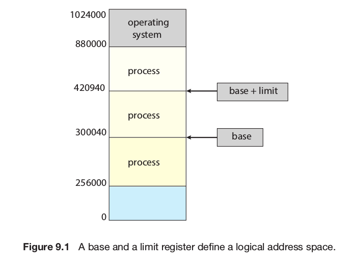
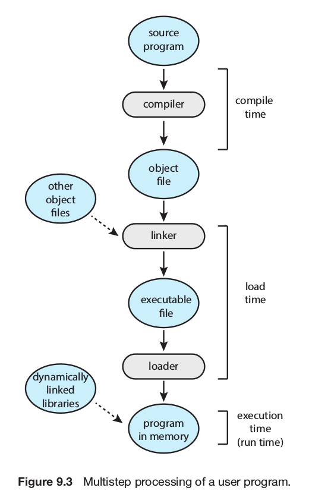

# Main Memory

## Background
**Memory**: Large array of bytes, each with its own address Memory Management issues:
* Basic Hardware
* The binding of symbols between ilogical and physical addresses

### Basic Hardware
The CPU only interacts directly with:
* Main memory
* Registers

Therefore, when any instruction that uses data is executed the data must be loaded in any of these **direct-access storage devices**.

When the CPU wants to use data that is not located in registers -> the CPU needs to stall while waiting for data being loaded from main memoery. Because of this,  the **cache** is located inside the memory chip. The hardware automatically does the work.

Each process has a **separete memory space**. For this, we can use two registers, base and limit, as shwon below:

* **Base register**: Holds the smallest legal physical memory address
* **Limit register**: Specifies the size of the range

The **protection scheme** is shown in the figure below

### Address Binding
When a process will **execute a program**, usually the program is loaded from disk to main memory.
The **first address of the user process** need not be 0000.

Steps that programs suffer:

### Logical Versus Physical Address Space

What is logical address? [click this]( https://techdifferences.com/difference-between-logical-and-physical-address.html).

Definitions:
* **Logical address / Virtual address**: Address generated by the CPU
* **Physical address**: Address seen by the memory unit, that is loaded into the **memory-address register**.
* **Logical address space**: Set of all logical addresses generated by a program
* **Physical address space**: Set of all physical address corresponding the logical address space.
* **Memory-mangement unit (MMU)**: Hardware device that run-time map from virtual to physical addresses.

* **Relocation register**: New base register, the value is added to every address generated by the CPU at the time the address is sent to memory.

### Dynamic Loading
**Problem**: Not all programs can be loaded in the physical memory, due to its limited size.
**Solution**: A routine is not loaded until it is called

### Dynamic Linking and Shared Libraries
Definitions:
* **Dynamic Linked Libraries (DLLs) / Shared Libraries**:
	* System libraries that are <mark>linked</mark> to user programs <mark>when</mark> the <mark>programs are run</mark>.
	* Can be <mark>shared</mark> by many processes.
	* Can be extended to <mark>library updates</mark>. Programs can point to the newer versions of the libraries.
	* Require <mark>help from the operating system</mark>.
* **Static linking**:
	* System libraries are treated like any other module and are <mark>combined</mark> by the loader <mark>into the binary program image</mark>.

## Swapping

### Standard Swapping

### Swapping on Mobile Systems

## Contiguous Memory Allocation
Main memory must contains both type of processes:
* Operating system processes
* User processes

An early method:
**Contiguos Memory Allocation**:
* Main memory is divided into two partitions
	* One for operating system processes: Can be stored at hight or low memory addresses (In Linux is in high).
	* Another for the user process
* Each process is contained in a single section of memory
* All section of memory are contiguous

### Memory Protection

### Memory Allocation

### Fragmentation

## Segmentation

### Basic Method

### Segmentation Hardware

## Paging

### Basic Method

### Hardware Support

### Protection

### Shared Pages

## Structure of the Page Table

### Hierarchical Paging

### Hashed Page Tables

### Inverted Page Tables

### Oracle Sparc

### Solaris
## Summary
